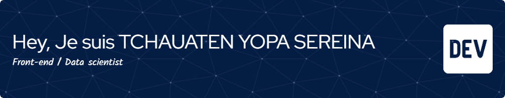

<h1 align="center">Hi 👋, Je suis TCHAUATEN YOPA SEREINA</h1>
<h2 align="center">Une developpeuse Camerounaise passionée de Data science (Science des données) et de front-end development</h2>

  

- 🔭 Je travaille actuellement sur **PRODUCTIVO**

- 🌱 J'apprends actuellement **Le WEB (Les bonnes pratiques), NUMPY, PANDAS, ETC**

- 💬 Poser moi les questions à propos de **HTML, SASS, Python**

- 📫 Comment me joindre **yopasereina1971@gmail.com**

- ⚡ Faits interessants **J'aime la musique, les voyages.**

<h3 align="left">Connect with me:</h3>

<h3 align="left">Languages and Tools:</h3>

                                  

&nbsp;

